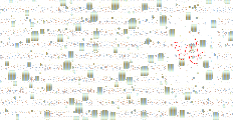

# maximalsquare

Multi-Thread기반 위에서 빈공간을 찾아 객체들을 배치 하고자 합니다.

</img>

## Youtube

https://youtu.be/xxxxx

## Compile

Visual Studio 를 기반으로 컴파일되도록 작성하였습니다.

## Description

전쟁게임 서버는 기동을 시작하면, DATABASE에서 저장된 정보를 읽어온후

필드에 배치되는 몬스터나, 자원섬등 기획적으로 랜덤하게 배치되어져야하는 객체들을 

아주 빠른시간 안에 분포된 빈공간을 찾아서 배치하기 위한 방법론과 알고리즘 입니다.

알고리즘을 Multi-Thread기반 위에서 분산처리가 되어지도록 구성을 하였습니다.

## Reference

[Maximal Square](https://leetcode.com/problems/maximal-square/solution/)
